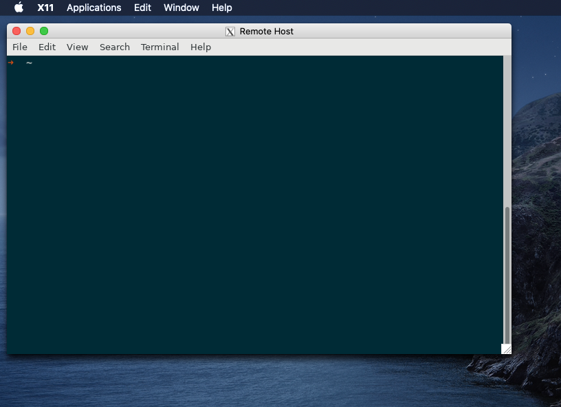

= X11 Forwarding
:page-layout:
:page-category: Networking
:page-tags: [OpenSSH, SSH, X11]

[caption=""]
.A Remote Instance of GNOME Terminal Viewed on macOS Catalina

'''

Opening a graphical application on a remote machine and displaying it locally is super convenient.
With https://www.openssh.com/[OpenSSH] and https://www.x.org/wiki/[X11], this is trivially accomplished via _X11 forwarding_.

== X11 Forwarding

This tutorial walks through running a graphical application remotely via X11 forwarding.
The local machine is assumed to be running the OpenSSH client and likewise the server is assumed to be running the OpenSSH server.
X11 must be available on both the client and server.

Although X11 is being superseded by https://wayland.freedesktop.org/[Wayland], many Unix-like systems still ship with some form of X11 today.
Wayland also specifies features for compatibility with X11, so X11 forwarding might continue to work even under your system's implementation of Wayland.
On macOS, the X11 software is available from the https://www.xquartz.org/[XQuartz project].

. Ensure the SSH server has the required https://www.x.org/archive/X11R6.8.1/doc/xauth.1.html[`xauth`] program.
+
[,sh]
----
➜ which xauth
/usr/bin/xauth
----

. On the SSH server, set `ForwardX11 yes` in `sshd_config` to enable X11 forwarding.
+
[source,ssh]
./etc/ssh/sshd_config
----
ForwardX11 yes
----

. Open an SSH connection with X11 forwarding by adding the `-X` flag on the command-line.
+
--
[,sh]
----
➜ ssh -CX mordor
----

[NOTE]
====
If you receive a warning that the file `.Xauthority` does not exist, ignore it.
It should disappear for subsequent SSH sessions on that host.
====

TIP: Enable compression when using X11 forwarding with the `-C` flag, as done here, to enhance the connection's performance.
--

. If the graphical application your using requires fully trusting X11, use the `-Y` flag instead.
+
--
[,sh]
----
➜ ssh -CY helms-deep
----

CAUTION: Your key presses can be captured on the remote machine so make sure you actually trust it.
--

. From the terminal, execute a graphical application, and it will be displayed locally so long as nothing goes awry.
+
--
Execute https://wiki.gnome.org/Apps/Terminal[GNOME Terminal], for instance.

[,sh]
----
➜ gnome-terminal
----
--

. If you always require X11 forwarding when connecting to a particular host, add the relevant options to enable it in your SSH client's configuration.
+
--
[source,ssh]
.~/.ssh/config
----
Host helms-deep
Compression yes
ForwardX11 yes
ForwardX11Trusted yes
----

CAUTION: Never indiscriminately enable X11 forwarding.
--

. Optionally, background the SSH process when running a remote X11 application.
+
--
It's not necessary to keep a dedicated terminal open with the SSH process running.
Use the `-f` flag to execute a program on the remote machine and background the SSH process.
The following example demonstrates this by running GNOME Terminal on the remote host.

[,sh]
----
➜ ssh -CYf helms-deep gnome-terminal
----
--

== Conclusion

You should now be able to take advantage of X11 forwarding built into OpenSSH to run graphical applications on a remote machine while viewing them locally.

== References

https://www.tiltedwindmillpress.com/product/ssh-mastery-2nd-edition/[SSH Mastery, 2nd Edition by Michael W. Lucas]

https://wiki.archlinux.org/index.php/OpenSSH#X11_forwarding[Arch Wiki: OpenSSH - X11 forwarding]
