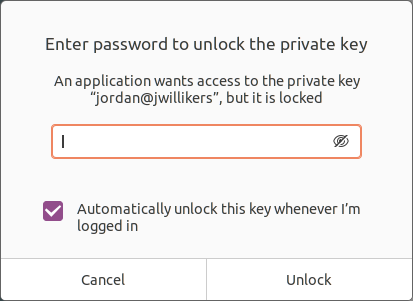

= Generate an SSH Key
:page-layout:
:page-category: Networking
:page-tags: [BSD, Linux, macOS, OpenSSH, SSH]

Entering passwords is a pain.
I know you agree.
Why not enter passwords less by using https://www.ssh.com/ssh/[SSH]?
You'll just need a key and a little know-how to get started.

== Generate an SSH Key

SSH is ubiquitous.
It's used by developers and systems administrators every day all across the globe to securely connect to machines.
Through cryptographic means, it is capable of establishing a secure connection between two hosts across a network.
This guide details how to generate an SSH key and two common use cases, authenticating with GitHub and connecting to a remote host.
This guide uses the https://www.openssh.com/[OpenSSH] client and server implementations.
The client and server are assumed to be running https://ubuntu.com/[Ubuntu], although most of these instructions are identical on any Unix-like operating system using the OpenSSH implementations.
It is assumed you are familiar with the command-line on Unix-Like systems, https://git-scm.com/[Git], and https://github.com/[GitHub].

. Generate a key with the https://man.openbsd.org/ssh-keygen.1[`ssh-keygen`] command.
+
[,sh]
----
➜ ssh-keygen
Generating public/private rsa key pair.
----

. Typically, you will generate exactly one SSH key for your user account on a particular host, so use the default file.
+
--
[source]
----
Enter file in which to save the key (/home/jordan/.ssh/id_rsa): 
----

[NOTE]
====
This file is the private key.
Two key files are actually generated, which together form what is known as a key pair.
The public key file will be placed in the same directory and use the same name with `.pub` appended.
In this case, `/home/jordan/id_rsa.pub` is the corresponding public key file.
====

[CAUTION]
====
Never move your private SSH key across the network or send it to anyone else.
In fact, it's generally best to keep this key exactly where it is generated, backing it up to offline media.
====
--

. Enter a strong passphrase to protect your key.
+
--
[source]
----
Enter passphrase (empty for no passphrase): 
----

This passphrase is used to encrypt your private key file.
Even if someone gains access to the key file, they can't use it to authenticate as you so long as they don't have the passphrase.
--

. To finish the creation process, re-enter your nice, strong passphrase.
+
[source]
----
Enter same passphrase again: 
Your identification has been saved in /home/jordan/.ssh/id_rsa
Your public key has been saved in /home/jordan/.ssh/id_rsa.pub
The key fingerprint is:
SHA256:UdHmkL8i0EME+VYLGydcmV3B1nTk0unPYTHf4WBvnFo jordan@jwillikers
The key's randomart image is:
+---[RSA 3072]----+
|     X@*+..      |
|    ==X@o=       |
|   + OO+E.       |
|    Xo=*=        |
|   o oo+S.       |
|     . o..       |
|        .        |
|                 |
|                 |
+----[SHA256]-----+
----

. Now that your key is generated, you'll probably want to add its passphrase to your login keyring so that you don't have to type it all the darn time.
+
--
Ubuntu, macOS, and many other Linux desktops will prompt you to save this key to your keychain when you have to unlock it.
The best way to do this is to just use your key, such as described in the following two sections.
On Ubuntu, check the box to automatically unlock the key when you login.

.Save the Password for Your SSH Key on Ubuntu
[caption=""]

[TIP]
====
For integration with the system keychain to work, make sure to use the system's SSH client in order to trigger this mechanism.
This can be an issue if you have other versions of OpenSSH on your machine.
I ran into this on macOS when using a newer version of the OpenSSH client provided by https://www.macports.org/[MacPorts].
The prompt never appeared when using this SSH client.
Establishing an SSH connection by calling `/usr/bin/ssh` directly successfully triggered the prompt.
====

[NOTE]
====
These systems take care of running an https://man.openbsd.org/ssh-agent.1[SSH agent] for you.
An SSH agent stores your key unencryped in RAM, so that you don't have to enter your passphrase to decrypt it each time you wish to use it.
Not all platforms start the SSH agent and add your key to it for you.
On these platforms, you'll have to do this yourself.
====
--

=== GitHub

Accessing private repositories or enabling certain privileges on public repositories, such as push access to a repository, will require some form of user authentication.
Working with Git repositories is much easier when SSH handles required authentication.
GitHub is used as an example here because it is so widely used.

. Don't forget to install Git if you haven't already.
+
[,sh]
----
➜ sudo apt -y install git
----

. Open your https://github.com/settings/keys[SSH and GPG keys] settings page in a web browser.
+
NOTE: For up-to-date instructions, refer to https://docs.github.com/en/free-pro-team@latest/github/authenticating-to-github/adding-a-new-ssh-key-to-your-github-account[GitHub's documentation].

. Select the btn:[New SSH key] button.

. Optionally, enter a name for this key in the _Title_ field.
+
--
The user and host name of the given key will be used by default if this field is left blank.
--

. Copy the public key.
+
--
This can be accomplished by dumping the contents of the public key to your terminal and copying the output from there.

[,sh]
----
➜ cat ~/.ssh/id_rsa.pub
ssh-rsa AAAAB3NzaC1yc2EAAAADAQABAAABgQDoxvFhlQciJxydpZVKnNwVYtSZI8hw6aF3ug961FAHzp1sbuZJm++rFSG30wwxeXK3r+FPXXnEnmPW53dn26ywFChHRRpN4zgyEdCXYLBOILObm/9z6hnOa8MReNC9VKH5xBq5CH4YmNfJjmJ5LaeI9PMbF/++F+n+QDTWgpfwKu3FxJYRtQ4NLd5q2QOvwpzQ3M2FOkqJ0N//qwiuJNLtUmDZQRqpeZCbhhAptrF6yyYME70pMKQFuE5gEzZThDIP6TAPuu0L4LECwossWlsA4bvhOK8wN0KWfvuZLx6r/8ld4P9/3FkshuTsWXIDbykewR4QcPE8EcpVNFH6l+zrLBCkndOimN4iLy7eBPPfdLZG1yfcusA0pPMiYKiA4SYzh6w2wrt0Y0wV1/npNHvZM/qS/2tJTkwYYKLxRah3SdR7onJQzWn67SdzxJ5FO5xQB5HsMMe99JTqaHEGEiUrGFB5MsqUbtTqHo3ZMYre0uEax03omq3pZel+MCj52S8= jordan@jwillikers
---- 
--

. Paste the contents of the public key file in the _Key_ field.

. Click the btn:[Add SSH key] button to upload the key.

. Clone the desired repository using its SSH URL.
+
--
Here, I clone the repository for this blog over SSH.

[,sh]
----
➜ git clone git@github.com:jwillikers/blog.git
----
--

=== Remote Access

For remotely accessing a host, some configuration is required.

. On the remote machine, make sure to install the OpenSSH server.
+
[,sh]
----
➜ sudo apt -y install openssh-server
----

. Copy the public from your account to the target user's `~/.ssh/known_hosts` file on the remote host.
+
--
The https://www.ssh.com/ssh/copy-id[`ssh-copy-id`] command is usually available for just this task.

[,sh]
----
➜ ssh-copy-id remote_host
----

If it's not available you might be able to install a package for it, such as on https://www.openbsd.org/[OpenBSD].

[,sh]
----
➜ doas pkg_add ssh-copy-id
----

Or, you can just use https://man7.org/linux/man-pages/man1/cat.1.html[`cat`], courtesy of https://mwl.io/[Michael W. Lucas].

[,sh]
----
➜ cat ~/.ssh/id_rsa.pub | \
  ssh remote_host "cat >> ~/.ssh/authorized_keys"
----
--

. Enter your passphrase when prompted.

. You should now be able to authenticate with your SSH key.
+
[,sh]
----
➜ ssh remote_host
----

== Conclusion

Now that you are barely capable of generating and using an SSH key, read https://www.tiltedwindmillpress.com/product/ssh-mastery-2nd-edition/[SSH Mastery] by Michael W. Lucas for a much more comprehensive understanding.
