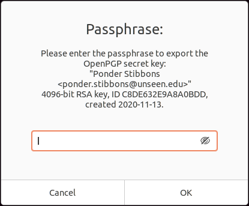
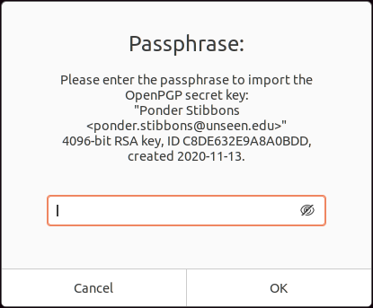

= Backup and Restore a GPG Key
:page-layout:
:page-category: Security
:page-tags: [Backups, GnuPG, GPG, OpenPGP, Ubuntu]

https://gnupg.org/[Gnu Privacy Guard], also known as GnuPG and GPG, is a handy tool for managing https://www.openpgp.org/[OpenPGP] keys.
While don't use PGP keys for email encryption as many people do, I do use a PGP key to sign my work when using https://git-scm.com/[Git].
PGP keys can be a bit nastier to replace than an SSH key, so making backups is critical for reducing future headaches.

== Tutorial

The following steps will show you how to backup and restore a PGP key using GnuPG, version 2.2.20 to be exact.
The backup is electronic, not physical, such as backups created with https://www.jabberwocky.com/software/paperkey/[PaperKey].
I recommend also creating a backup key on paper with PaperKey and keeping it in a safe place for an added layer of redundancy.
It is expected you are already familiar using GnuPG from the command-line and have an existing installation of GPG with a key pair available to backup.

=== Backup

. First, determine which key to backup.
+
--
[,sh]
----
➜ gpg --list-secret-keys --keyid-format LONG
/home/pstibbons/.gnupg/pubring.kbx
-------------------------------
sec   rsa4096/C8DE632E9A8A0BDD 2020-11-13 [SC]
      F38915B041F5F1024AF95C30C8DE632E9A8A0BDD
uid                 [ultimate] Ponder Stibbons <ponder.stibbons@unseen.edu>
ssb   rsa4096/DBCD8B98F2F9188C 2020-11-13 [E]
----

Here there is only one private key for a Ponder Stibbons.
--

. Export the private GPG key.
+
--
[,sh]
----
➜ gpg -o private.gpg --export-options backup --export-secret-keys ponder.stibbons@unseen.edu
----

This invocation places the key in the file `private.gpg` in the current directory.
The export option `backup` exports all necessary data for GnuPG to restore the key.
--

. Enter the private key's passphrase in the <<Export Passphrase Prompt>> to export the key.
+
[caption=""]
.Export Passphrase Prompt

. Now place this backup somewhere safe.
Ideally, store it only on offline media.

=== Restore

. Import the private key.
+
--
[,sh]
----
➜ gpg --import-options restore --import private.gpg
gpg: key C8DE632E9A8A0BDD: public key "Ponder Stibbons <ponder.stibbons@unseen.edu>" imported
gpg: key C8DE632E9A8A0BDD: secret key imported
gpg: Total number processed: 1
gpg:               imported: 1
gpg:       secret keys read: 1
gpg:   secret keys imported: 1
----

This invocation imports the key from the file `private.gpg` in the current directory.
The import option `restore` imports all necessary data for GnuPG to fully restore the key.
The import option `keep-ownertrust` keeps the owner trust of the key instead of clearing it's trust value.
This saves having to manually set the trust value for the key later.
--

. Enter the private key's passphrase in the <<Import Passphrase Prompt>> to import the key.
+
[caption=""]
.Import Passphrase Prompt

. Now, edit the freshly imported key.
+
[,sh]
----
➜ gpg --edit-key ponder.stibbons@unseen.edu
gpg (GnuPG) 2.2.20; Copyright (C) 2020 Free Software Foundation, Inc.
This is free software: you are free to change and redistribute it.
There is NO WARRANTY, to the extent permitted by law.

Secret key is available.

sec  rsa4096/C8DE632E9A8A0BDD
     created: 2020-11-13  expires: never       usage: SC
     trust: unknown       validity: unknown
ssb  rsa4096/DBCD8B98F2F9188C
     created: 2020-11-13  expires: never       usage: E
[ unknown] (1). Ponder Stibbons <ponder.stibbons@unseen.edu>
----

. Enter `trust` to modify the trust value of the key.
+
[,sh]
----
gpg> trust
sec  rsa4096/C8DE632E9A8A0BDD
     created: 2020-11-13  expires: never       usage: SC
     trust: unknown       validity: unknown
ssb  rsa4096/DBCD8B98F2F9188C
     created: 2020-11-13  expires: never       usage: E
[ unknown] (1). Ponder Stibbons <ponder.stibbons@unseen.edu>
----

. Type kbd:[5] to trust your keys completely.
+
[,sh]
----
Please decide how far you trust this user to correctly verify other users' keys
(by looking at passports, checking fingerprints from different sources, etc.)

  1 = I don't know or won't say
  2 = I do NOT trust
  3 = I trust marginally
  4 = I trust fully
  5 = I trust ultimately
  m = back to the main menu

Your decision? 5
----

. Confirm your choice by entering kbd:[Y].
+
[,sh]
----
Do you really want to set this key to ultimate trust? (y/N) y

sec  rsa4096/C8DE632E9A8A0BDD
     created: 2020-11-13  expires: never       usage: SC
     trust: ultimate      validity: unknown
ssb  rsa4096/DBCD8B98F2F9188C
     created: 2020-11-13  expires: never       usage: E
[ unknown] (1). Ponder Stibbons <ponder.stibbons@unseen.edu>
Please note that the shown key validity is not necessarily correct
unless you restart the program.
----

. Use the command `quit` to exit.
+
[,sh]
----
gpg> quit
----

== Conclusion

You should now be able to backup and restore your private GPG keys.
