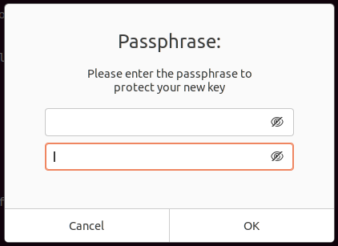

= Generate a GPG Key
:page-layout:
:page-category: Security
:page-tags: [Backups, GnuPG, GPG, OpenPGP, Ubuntu]

https://gnupg.org/[GPG] keys can be used to cryptographically sign https://git-scm.com/[Git] commits, pushes, and tags.
This associates your work with a particular identity.
GPG is also used for encrypting and signing emails.
To do these things, you first need a GPG key.

== Tutorial

The instructions here describe the steps to generate a GPG key on https://ubuntu.com/[Ubuntu] 20.04.
On the Ubuntu desktop, GPG is preinstalled.
Detailed instructions for creating a key can be found in https://docs.github.com/en/free-pro-team@latest/github/authenticating-to-github/generating-a-new-gpg-key[GitHub's documentation].

. Create a new key.
+
[,sh]
----
➜ gpg --full-generate-key
gpg (GnuPG) 2.2.20; Copyright (C) 2020 Free Software Foundation, Inc.
This is free software: you are free to change and redistribute it.
There is NO WARRANTY, to the extent permitted by law.
----

. Press enter to accept the default key type, `RSA and RSA`.
+
[source]
----
Please select what kind of key you want:
(1) RSA and RSA (default)
(2) DSA and Elgamal
(3) DSA (sign only)
(4) RSA (sign only)
(14) Existing key from card
Your selection?
----

. Enter 4096 for the key size.
+
[source]
----
RSA keys may be between 1024 and 4096 bits long.
What keysize do you want? (3072) 4096
Requested keysize is 4096 bits
----

. Press enter to accept the default for the length of time the key will be valid which is forever.
+
[source]
----
Please specify how long the key should be valid.
0 = key does not expire
<n> = key expires in n days
<n>w = key expires in n weeks
<n>m = key expires in n months
<n>y = key expires in n years
Key is valid for? (0)
----

. Type kbd:[Y] and press enter again to confirm this.
+
[source]
----
Key does not expire at all
Is this correct? (y/N) y
----

. Input the name to use for the key's associated identity.
+
[source]
----
GnuPG needs to construct a user ID to identify your key.

Real name: Ponder Stibbons
----

. Then just enter your commit email address.
+
[source]
----
Email address: ponder.stibbons@unseen.edu
----

. Add a comment if desired.
+
[source]
----
Comment:
----

. Confirm your identity information by typing kbd:[O].
+
[source]
----
You selected this USER-ID:
"Ponder Stibbons <ponder.stibbons@unseen.edu>"

Change (N)ame, (C)omment, (E)mail or (O)kay/(Q)uit? O
----

. Enter a passphrase for your key in the <<Passphrase Prompt>>.
+
[caption=""]
.Passphrase Prompt

. This should output information similar to the following when your key has been successfully generated.
+
[source]
----
We need to generate a lot of random bytes. It is a good idea to perform
some other action (type on the keyboard, move the mouse, utilize the
disks) during the prime generation; this gives the random number
generator a better chance to gain enough entropy.
gpg: key 5DBCB56A458D5A0F marked as ultimately trusted
gpg: directory '/home/pstibbons/.gnupg/openpgp-revocs.d' created
gpg: revocation certificate stored as '/home/pstibbons/.gnupg/openpgp-revocs.d/00DD666179AF17FB2D5DF49B5DBCB56A458D5A0F.rev'
public and secret key created and signed.

pub   rsa4096 2020-10-27 [SC]
      00DD666179AF17FB2D5DF49B5DBCB56A458D5A0F
uid                      Ponder Stibbons <ponder.stibbons@unseen.edu>
sub   rsa4096 2020-10-27 [E]
----

[TIP]
====
If you have multiple secret keys and would like to use this key by default, set it as such in `~/.gnupg/gpg.conf` as follows.

[,sh]
----
➜ echo "default-key 5DBCB56A458D5A0F" >> ~/.gnupg/gpg.conf
----

Of course, make sure to substitute the id specific to your key here.
====

== Conclusion

You now have your very own GPG key!
Check out my post on how to <<backup-and-restore-a-gpg-key#,Backup and Restore a GPG Key>> because you will want to make sure not to lose your new key!
