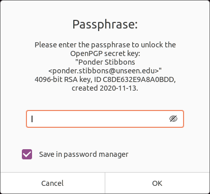

= Git and GPG
:page-layout:
:page-category: Development
:page-tags: [Cryptography, Git, GnuPG, GPG, OpenPGP, Ubuntu]

https://gnupg.org/[GPG] keys can be used to cryptographically sign your work when using https://git-scm.com/[Git] for version control.
This ties your identity to your work, whether that's a commit, tag, or even a push.
https://gitea.io/en-us/[Gitea], https://github.com/[GitHub], https://github.com/[GitLab], and other popular Git hosting services support visualizing this feature when browsing changes, showing which commits are verified.

== Tutorial

This tutorial describes how to use GPG to sign your work with Git, including command-line incantations and configuration options.
It is assumed you already have a GPG key pair for your commit email.
If not, I describe the exact steps in <<generate-a-gpg-key#,Generate a GPG Key>>.
I also recommend you checkout my post <<backup-and-restore-a-gpg-key#,Backup and Restore a GPG Key>> for ways to avoid the pain of losing your private key.
The official Git Book contains a very useful section on this topic, https://git-scm.com/book/en/v2/Git-Tools-Signing-Your-Work[Git Tools Signing Your Work].
With that said, https://ubuntu.com/[Ubuntu] 20.04 is used as the reference system and familiarity with Git, GPG, and the command-line on Linux is assumed.

[NOTE]
====
All Git configuration settings are done _globally_, i.e. for the user in these steps.
They may just as easily be configured at the repository level.
====

. Install https://packages.ubuntu.com/focal/git[Ubuntu's git package], of course.
+
[,sh]
----
sudo apt -y install git
----

. Set your Git username.
+
[,sh]
----
git config --global user.name "Ponder Stibbons"
----

. Set your Git commit email address.
+
[,sh]
----
git config --global user.email "ponder.stibbons@unseen.edu"
----

. Identify the GPG secret key associated with your Git commit email address.
+
[,sh]
----
gpg --list-secret-keys --keyid-format LONG
/home/pstibbons/.gnupg/pubring.kbx
-------------------------------
sec   rsa4096/C8DE632E9A8A0BDD 2020-11-13 [SC] # <1>
      F38915B041F5F1024AF95C30C8DE632E9A8A0BDD
uid                 [ultimate] Ponder Stibbons <ponder.stibbons@unseen.edu>
ssb   rsa4096/DBCD8B98F2F9188C 2020-11-13 [E]
----
<1> The secret key's id is `C8DE632E9A8A0BDD`, the string of letters and numbers following `rsa4096/`.
The `sec` word indicates this is the secret key.

. Configure this key as your default signing key for Git.
+
--
[,sh]
----
git config --global user.signingKey C8DE632E9A8A0BDD
----

NOTE: The key can be provided when signing a tag, commit, or push, but it's generally more convenient to configure your default key,
--

. Create a test directory for a test repository.
+
[,sh]
----
mkdir git-signing-test
----

. Change into the directory.
+
[,sh]
----
cd git-signing-test
----

. Initialize a new Git repository.
+
[,sh]
----
git init
----

. Create an example file.
+
[,sh]
----
touch test
----

. Stage this file in order to make a signed commit.
+
[,sh]
----
git add test
----

. Pass the `-S` short option to http://manpages.ubuntu.com/manpages/focal/en/man1/git-commit.1.html[git-commit(1)] to manually sign a commit.
+
[,sh]
----
git commit -S -m 'Signed commit'
----

. Enter the passphrase for your private key in the <<Passphrase Prompt>>.
+
--
[caption=""]
.Passphrase Prompt

TIP: If you value your sanity, check the _Save in password manager_ box to avoid unlocking your key for every signature.
--

. Optionally, configure Git to sign commits by default with https://manpages.ubuntu.com/manpages/focal/en/man1/git-config.1.html[git-config(1)] thus allowing you to omit the `-S` flag.
+
--
[,sh]
----
git config --global commit.gpgSign true
----

NOTE: This configuration setting applies to merge commits created when using https://manpages.ubuntu.com/manpages/focal/en/man1/git-pull.1.html[git-merge(1)] and https://manpages.ubuntu.com/manpages/focal/en/man1/git-pull.1.html[git-pull(1)].
--

. Check a signed commit by using the `--show-signature` option with `git log`.
+
--
[,sh]
----
git log --show-signature -1
commit 48fafff3d24a89ec9c6d5940317588f9b10b4f43 (HEAD -> master)
gpg: Signature made Sat 14 Nov 2020 09:53:05 AM CST
gpg:                using RSA key F38915B041F5F1024AF95C30C8DE632E9A8A0BDD
gpg: Good signature from "Ponder Stibbons <ponder.stibbons@unseen.edu>" [ultimate]
Author: Ponder Stibbons <ponder.stibbons@unseen.edu>
Date:   Sat Nov 14 09:53:05 2020 -0600

    Signed commit
----

IMPORTANT: When verifying GPG signatures, you will need to have the signer's public key in your GPG keyring.
--

. Manually sign a tag with the `-s` short option.
+
[,sh]
----
git tag -s v1.0.0 -m 'Signed tag'
----

. If desired, configure Git to sign all tags by default.
+
[,sh]
----
git config --global tag.gpgSign true
----

. Verify a tag with the `-v` option.
+
[,sh]
----
git tag -v v1.0.0
object 48fafff3d24a89ec9c6d5940317588f9b10b4f43
type commit
tag v1.0.0
tagger Ponder Stibbons <ponder.stibbons@unseen.edu> 1605369450 -0600

Signed tag
gpg: Signature made Sat 14 Nov 2020 09:57:30 AM CST
gpg:                using RSA key F38915B041F5F1024AF95C30C8DE632E9A8A0BDD
gpg: Good signature from "Ponder Stibbons <ponder.stibbons@unseen.edu>" [ultimate]
----

. Create and switch to a new branch.
+
[,sh]
----
git switch -c unsigned
Switched to a new branch 'unsigned'
----

. Create another file.
+
[,sh]
----
touch test2
----

. Stage the new file.
+
[,sh]
----
git add test2
----

. Now, commit the file without a signature.
+
[,sh]
----
git commit --no-gpg-sign -m 'Unsigned commit'
----

. Switch back to the main branch.
+
[,sh]
----
git switch master
Switched to branch 'master'
----

. When using https://manpages.ubuntu.com/manpages/focal/en/man1/git-merge.1.html[git-merge(1)], sign a merge commit by passing the `-S` option and verify all signatures in the merge with the `--verify-signatures` option.
+
--
[,sh]
----
git merge -S --verify-signatures unsigned
fatal: Commit a3bf413 does not have a GPG signature.
----

Oh no! The unsigned commit in the _unsigned_ branch couldn't be verified so the merge failed.
--

. To always verify signatures when merging, set the configuration option `merge.verifySignatures` to `true`.
+
--
[,sh]
----
git config --global merge.verifySignatures true
----

NOTE: This configuration setting also applies to the https://manpages.ubuntu.com/manpages/focal/en/man1/git-pull.1.html[git-pull(1)] command.
--

. For https://manpages.ubuntu.com/manpages/focal/en/man1/git-pull.1.html[git-pull(1)], use the same options as with https://manpages.ubuntu.com/manpages/focal/en/man1/git-merge.1.html[git-merge(1)] to sign a merge commit and verify all signatures.
+
[,sh]
----
git pull -S --verify-signatures
----

. Sign pushes by using the `--signed` long option with https://manpages.ubuntu.com/manpages/focal/en/man1/git-push.1.html[git-push(1)].
+
--
This option takes more than just a true or false value.
The `if-asked` value used here signs pushes if the server supports this feature, but doesn't otherwise.
Signing pushed signifies _intent_, as Konstantin Ryabitsev describes in more detail in his article https://people.kernel.org/monsieuricon/signed-git-pushes[Signed git pushes].

[,sh]
----
git push --signed=if-asked
----
--

. Configure Git to sign pushes by default if the server supports it.
+
[,sh]
----
git config --global push.gpgSign if-asked
----

== Conclusion

Now go setup your key for use with your Git servers and start rolling out your signed commits!
